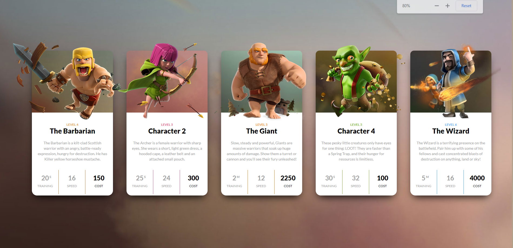
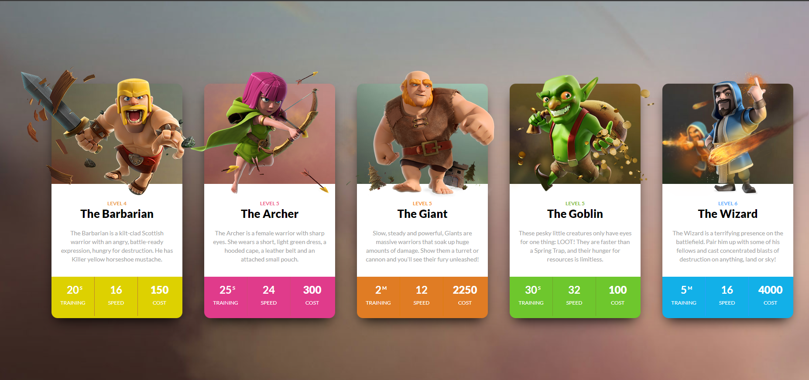

 # DOM ASSIGNMENT #

 ## 4<sup>th</sup> Assignment ##
**Intial Look of website**
 


- The Task is add following thing using DOM 
 - 1-> Change the title of second card from Character 2 TO The Archer
 - 2-> Change the title of the fourth card from Character 4 TO The Goblin
 - 3-> Add the color to the power or ablity section of the each card

**Output**


**Code**

``` javascript
    
    /*Changeing the name*/
        let secondTitle =  document.querySelector('.clash-card.archer div:nth-of-type(3)');
        //console.log(secondTitle);
        secondTitle.textContent="The Archer"

        let fourthTitle =  document.querySelector('.clash-card.goblin div:nth-of-type(3)');
        fourthTitle.textContent="The Goblin"


        /*Changing the color of the ablities*/


       const card1=document.querySelector(".clash-card__unit-stats.clash-card__unit-stats--barbarian.clearfix")
       card1.style.color="#FFFF"
       card1.style.backgroundColor="#DDD101"
       const cost1TextColor = card1.querySelector(".clash-card__unit-stats.clash-card__unit-stats--barbarian.clearfix div:nth-of-type(3)")
       cost1TextColor.style.color="#FFFF"


       const card2 =document.querySelector(".clash-card__unit-stats.clash-card__unit-stats--archer.clearfix")
       card2.style.backgroundColor="#E03B8B"
       card2.style.color="#FFFF"
       const cost2TextColor =card2.querySelector(".clash-card__unit-stats.clash-card__unit-stats--archer.clearfix div:nth-of-type(3)")
       cost2TextColor.style.color="#FFFF"


       const card3=document.querySelector(".clash-card__unit-stats.clash-card__unit-stats--giant.clearfix")
       card3.style.color="#FFFF"
       card3.style.backgroundColor="#E07C24"
       const cost3TextColor=card3.querySelector(".clash-card__unit-stats.clash-card__unit-stats--giant.clearfix div:nth-of-type(3)")
       cost3TextColor.style.color="#FFFF"

       const card4=document.querySelector(".clash-card__unit-stats.clash-card__unit-stats--goblin.clearfix")
       card4.style.color="#FFFF"
       card4.style.backgroundColor ="#6EC72D"
       const cost4TextColor=card4.querySelector(".clash-card__unit-stats.clash-card__unit-stats--goblin.clearfix div:nth-of-type(3)")
       cost4TextColor.style.color="#FFFF"


        const card5 =document.querySelector(".clash-card__unit-stats.clash-card__unit-stats--wizard.clearfix")
        card5.style.color="#FFFF"
        card5.style.backgroundColor="#12B0E8"
        const cost5TextColor = card5.querySelector(".clash-card__unit-stats.clash-card__unit-stats--wizard.clearfix div:nth-of-type(3)")
        cost5TextColor.style.color="#FFFF"
        
 ```
 


