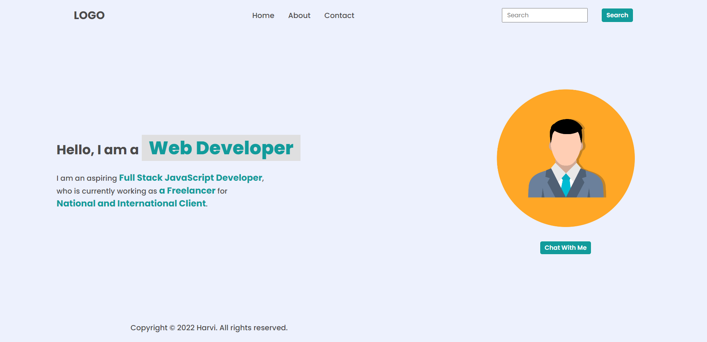
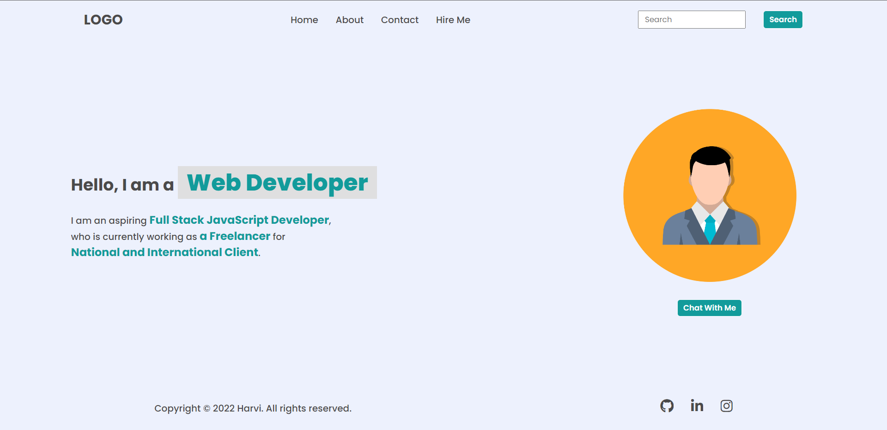
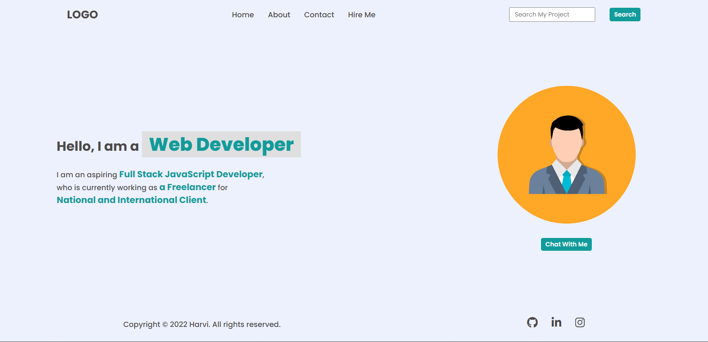
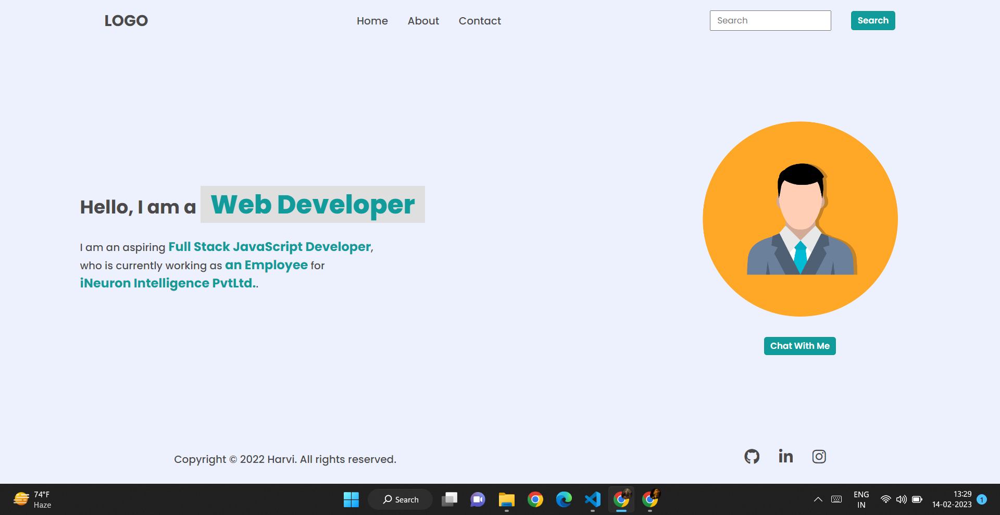
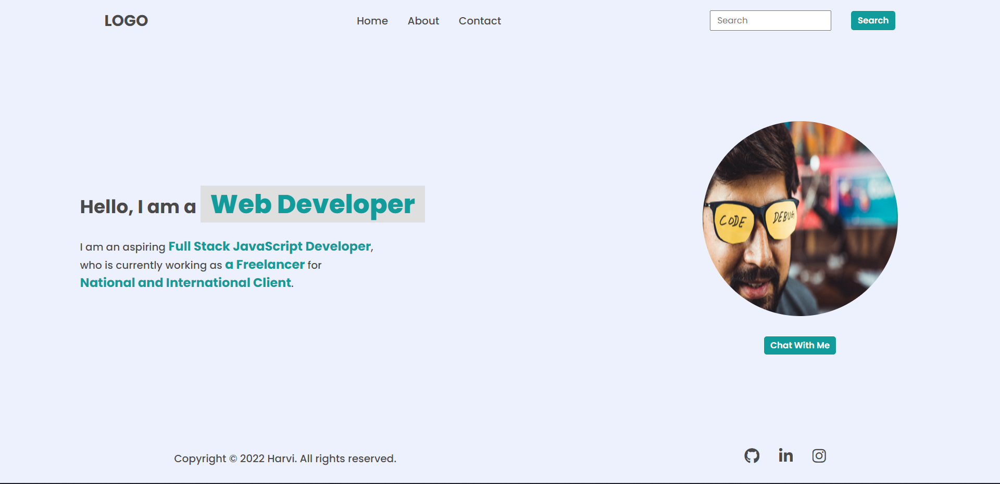
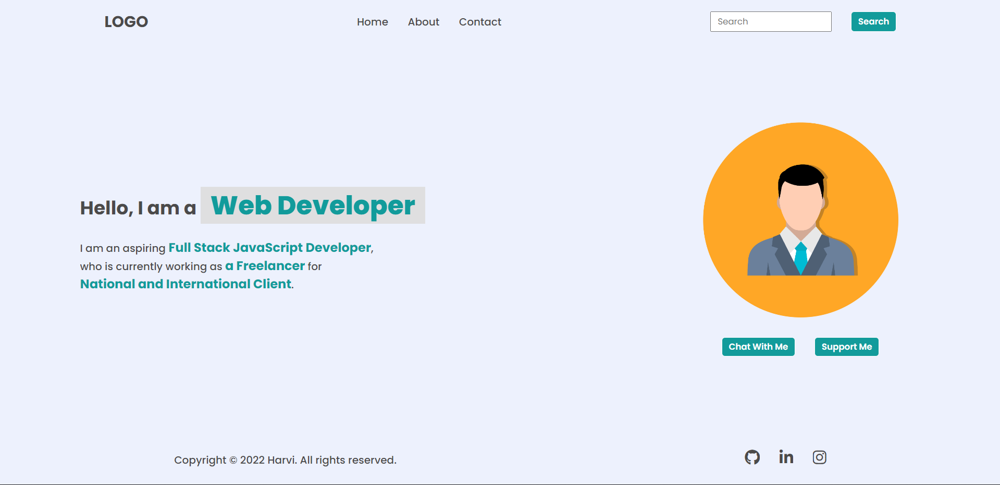
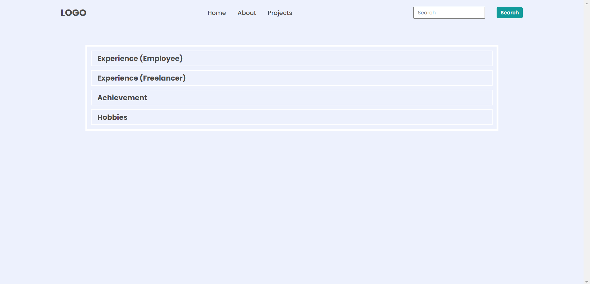
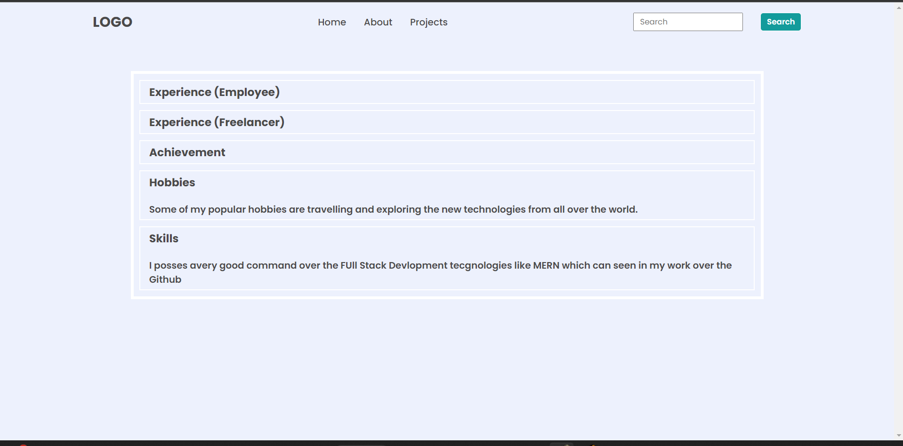
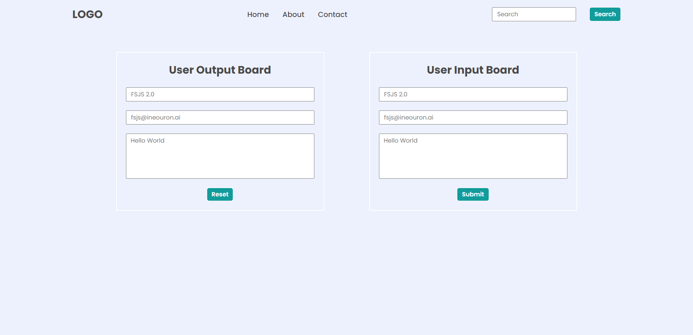

 # DOM ASSIGNMENT #

 ## First-Assignment ##
**Intial Look of website**
 


- The Task is to add the Hire Me in the nav bar  by using DOM

**Output**


**Code**

``` javascript
    let newele = document.createElement("li");
    newele.innerHTML="<a>Hire Me</a>"
    let onAddEle=document.querySelector("ul")
    onAddEle.appendChild(newele)
 ```


- The Task is to change the placholder of ther Search to Search My Project by using DOM

**Output**


**Code**

``` javascript
      let div = document.querySelector(".search-field")
      let input =div.querySelector("input")
      input.placeholder ="Search My Project"
   
 ```
 


- The Task is to  change the paragraph Text
 - 1-> a Freelancer TO a Employee
 - 2->National and internation Client TO iNeuron Intelligence PvtLtd.

**Output**


**Code**

``` javascript
      let freelancer = document.querySelector('.hero-left-section p span:nth-child(3)');
      let clients = document.querySelector('.hero-left-section p span:nth-child(5)');
      freelancer.textContent = 'an Employee';
     clients.textContent = 'iNeuron Intelligence PvtLtd.';
   
 ```

 


- The Task is to  change the avtar to hitesh sir photo

**Output**


**Code**

``` javascript
   let div =document.querySelector(".hero-right-section")
   let img =div.querySelector("img")
   img.outerHTML = " "

  
   
 ```
 
 
- The Task is to  add extra button of Support me  using DOM

**Output**


**Code**

``` javascript
    let btn=document.createElement("button")
           btn.innerText="Support Me"
         let div = document.querySelector(".hero-right-section-btns")
           div.appendChild(btn);
   
 ```
 

 ## Second-Assignment ##

 

 - The Task is to  change the text of 3rd child of the nav which is contact To Projects using DOM

**Output**


**Code**

``` javascript
let link=document.querySelector("nav ul li:nth-child(3) a");
 link.innerText="Projects"
   
 ```

 

 - The Task is to  Add SKIILS Div under the FAQ section and also add h3 and p tag as giving in the task2Output.png using DOM

**Output**


**Code**

``` javascript
let parentDiv=document.querySelector(".accordian-wrapper")

let newDiv=document.createElement("div")

newDiv.className="accordian"

const newH3 = document.createElement("h3");
newH3.textContent = "Skills";

const newPara=document.createElement('p')
newPara.textContent = "I posses avery good command over the FUll Stack Devlopment tecgnologies like MERN which can seen in my work over the Github"

newDiv.appendChild(newH3)
newDiv.appendChild(newPara)


parentDiv.appendChild(newDiv)

   
 ```


 ## Third-Assignment ##

  
  

  - The Task is to  change the placeholder using DOm according to the requirement.

**Output**


**Code**

``` javascript
    let outName=document.querySelector(".enterName")
    let outEmail=document.querySelector(".enterMail")
    let outMessg=document.querySelector(".enterMessage")

    outName.placeholder="FSJS 2.0"
    outEmail.placeholder="fsjs@ineouron.ai"
    outMessg.placeholder="Hello World"


    let inName=document.querySelector(".userName")
    let inEmail=document.querySelector(".userEmail")
    let inMessg=document.querySelector(".userMessage")

    inName.placeholder="FSJS 2.0"
    inEmail.placeholder="fsjs@ineouron.ai"
    inMessg.placeholder="Hello World"

   
 ```